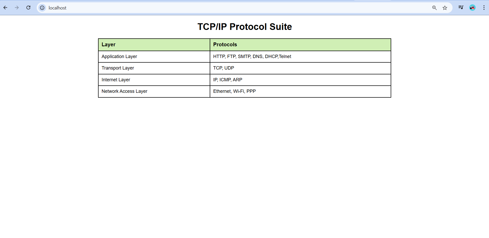

# EX01 Developing a Simple Webserver
## Date:

## AIM:
To develop a simple webserver to serve html pages and display the list of protocols in TCP/IP Protocol Suite.

## DESIGN STEPS:
### Step 1: 
HTML content creation.

### Step 2:
Design of webserver workflow.

### Step 3:
Implementation using Python code.

### Step 4:
Import the necessary modules.

### Step 5:
Define a custom request handler.

### Step 6:
Start an HTTP server on a specific port.

### Step 7:
Run the Python script to serve web pages.

### Step 8:
Serve the HTML pages.

### Step 9:
Start the server script and check for errors.

### Step 10:
Open a browser and navigate to http://127.0.0.1:8000 (or the assigned port).

## PROGRAM:

```
from http.server import HTTPServer, BaseHTTPRequestHandler

content = """
<!DOCTYPE html>
<html>
<head>
<title>TCP/IP Protocol Suite</title>
<style>
body {
font-family: Arial, sans-serif;
}
table {
width: 60%;
border-collapse: collapse;
margin: 20px auto;
border: 2px solid black;
}
th, td {
border: 2px solid black;
padding: 10px;
text-align: left;
}
th {
background-color: #d0efb5;
font-size: 18px;
}
td {
font-size: 16px;
}
h1 {
text-align: center;
}
</style>
</head>
<body>
<h1 align="center">TCP/IP Protocol Suite</h1>
<table>
<tr>
<th>Layer</th>
<th>Protocols</th>
</tr>
<tr><td>Application Layer</td><td>HTTP, FTP, SMTP, DNS, DHCP,Telnet</td></tr>
<tr><td>Transport Layer</td><td>TCP, UDP</td></tr>
<tr><td>Internet Layer</td><td>IP, ICMP, ARP</td></tr>
<tr><td>Network Access Layer</td><td>Ethernet, Wi-Fi, PPP</td></tr>
</table>
</body>
</html>

"""
class myhandler(BaseHTTPRequestHandler):
    def do_GET(self):
        print("request received")
        self.send_response(200)
        self.send_header('content-type', 'text/html; charset=utf-8')
        self.end_headers()
        self.wfile.write(content.encode())
server_address = ('',80)
httpd = HTTPServer(server_address,myhandler)
print("my webserver is running...")
httpd.serve_forever()


class myhandler (BaseHTTPRequestHandler):
    def do_GET(self):
        print("request received")
        self.send_response (200)
        self.send_header('content-type', 'text/html; charset=utf-8')
        self.end_headers()
        self.wfile.write(content.encode())
server_address = ('',8000)
httpd = HTTPServer(server_address, myhandler)
print("my webserver is running...")
httpd.serve_forever()


```
## OUTPUT:





## RESULT:
The program for implementing simple webserver is executed successfully.
